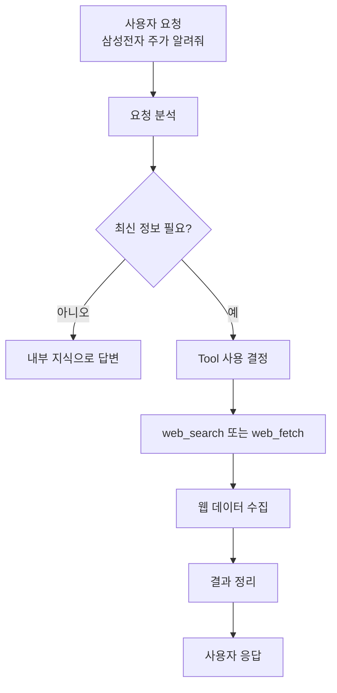
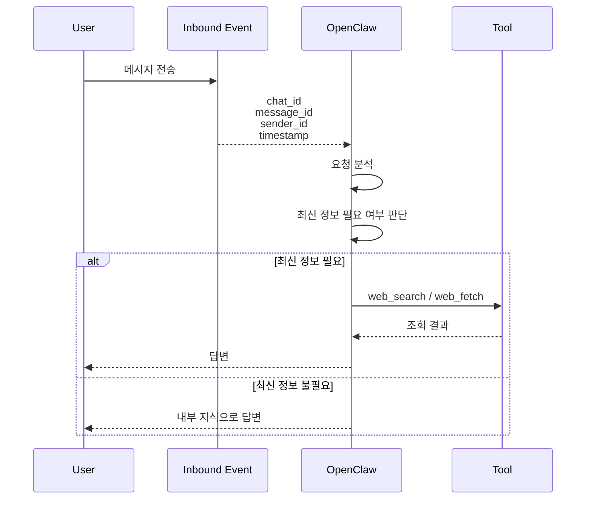

# OpenClaw의 Tool Calling 동작 방식 이해

## 실습 배경

OpenClaw를 Discord와 연동한 후 다음과 같은 질문을 수행하였다.

```text
삼성전자, 삼성전기 주가 알려줘
```

OpenClaw는 실제 주가를 조회하여 응답하였다.

이후 OpenClaw에게 직접 다음과 같은 질문을 하였다.

```text
너는 주가 조회하는 tool이 있는 거지?
```

---

# OpenClaw의 답변

```text
전용 주가 Tool은 없다.

대신

web_search
web_fetch

를 사용한다.
```

즉 OpenClaw는 금융 API를 직접 호출하는 것이 아니라, 웹 검색 및 웹 페이지 조회 기능을 이용하여 필요한 정보를 수집하고 있었다.

---

# web_search 와 web_fetch

## web_search

웹 검색 도구

예시

```text
삼성전자 주가
```

검색

↓

관련 페이지 목록 획득

```text
네이버 증권
한국거래소
삼성전자 IR
```

등

---

## web_fetch

특정 URL 내용을 가져오는 도구

예시

```text
https://finance.naver.com/item/main.naver?code=005930
```

↓

HTML 수집

↓

현재가, 등락률, 거래량 추출

---

# Tool Calling 이란?

질문

```text
web_fetch 가 tool calling 인거지?
```

답변

```text
그렇다.

내가 직접 웹을 여는 것이 아니라

백엔드 도구를 호출하여
정보를 가져오는 방식이다.
```

즉

```text
web_search
web_fetch
```

는 모두 Tool Calling 의 예시이다.

---

# 왜 Tool Calling 이 발생하는가?

질문

```text
삼성전자, 삼성전기 주가 알려줘
```

입력

↓

OpenClaw 내부 판단

```text
이 정보는 최신 정보가 필요하다.
```

↓

Tool 사용 결정

```text
web_search
또는
web_fetch
```

↓

조회 결과 수집

↓

답변 생성

---

# OpenClaw 내부 흐름

## Flow Chart



---

# Conversation Metadata 의 역할

OpenClaw는 사용자 메시지 외에도 다양한 메타데이터를 함께 전달받는다.

예시

```text
chat_id
message_id
sender_id
sender
timestamp
```

---

하지만 중요한 점은

```text
메타데이터가 Tool 호출을 결정하지는 않는다.
```

메타데이터는 단지

```text
누가
언제
어디서
```

보냈는지 알려주는 역할이다.

---

# Sequence Diagram



---

# 이번 실습을 통해 이해한 것

## 일반 LLM

```text
질문
↓
답변
```

내부 지식에만 의존

---

## RAG

```text
질문
↓
문서 검색
↓
답변
```

보유한 문서만 사용

실시간 정보 불가

---

## Tool Calling

```text
질문
↓
실시간 정보 필요 판단
↓
Tool 호출
↓
답변
```

실시간 데이터 가능

---

# 핵심 정리

OpenClaw는 단순히 LLM에게 질문을 전달하는 시스템이 아니다.

질문의 성격을 분석하여

- 내부 지식으로 답할지
- 문서를 검색할지(RAG)
- 외부 Tool을 호출할지

를 스스로 판단한다.

이번 주가 조회 사례는

```text
사용자 요청
↓
최신 정보 필요
↓
web_search / web_fetch 호출
↓
실시간 데이터 수집
↓
답변 생성
```

이라는 전형적인 Tool Calling 사례이다.