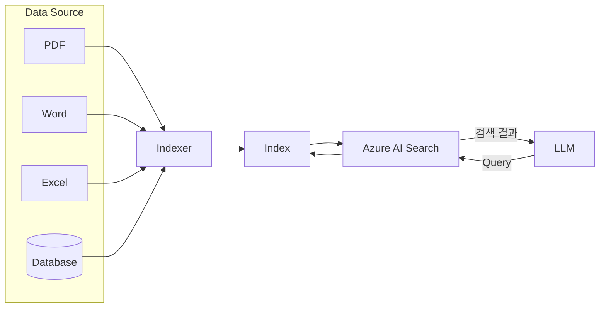

# Agentic AI 과정 Day3 - 4교시

## Azure AI Search

### Azure AI Search란?

과거 Azure Cognitive Search라는 이름으로 제공되던 서비스.

역할:

- 비정형 데이터 검색
- 정형 데이터 검색
- 벡터 검색
- RAG(Retrieval Augmented Generation)의 검색 계층

---

## Azure AI Search 아키텍처

강사 설명 및 판서 내용



---

## Data Source

원본 데이터 저장소

### 비정형 데이터

- PDF
- Word
- Excel
- PowerPoint
- HTML
- TXT

### 정형 데이터

- SQL Database
- Cosmos DB
- MySQL
- PostgreSQL

---

## Index

검색용 색인

원본 데이터를 직접 검색하지 않고 Index를 검색한다.

예:

```text
작업지시서.pdf
조립가이드.pdf
품질매뉴얼.docx
```

↓

```text
버튼
체결
토크
검사
```

등의 검색 가능한 정보로 저장

---

## Indexer

Data Source를 주기적으로 확인하여 Index를 갱신

기능:

- 신규 문서 발견
- 변경 문서 발견
- 삭제 문서 반영
- 자동 색인 갱신

예)

```text
새 PDF 업로드
↓
Indexer 감지
↓
Index 갱신
↓
검색 가능
```

---

## LLM과 Azure AI Search

LLM은 원본 문서를 직접 읽지 않는다.

```text
사용자 질문
↓
LLM
↓
Azure AI Search Query
↓
Index 검색
↓
검색 결과
↓
LLM 답변 생성
```

---

## Vector Index

강사 설명:

Index를 Vector 기반으로 만들면 검색 품질이 향상된다.

### 기존 Keyword Search

```text
자동차
```

검색

↓

문서에 "자동차"가 있어야 검색

---

### Vector Search

```text
자동차
차량
승용차
```

를 의미적으로 유사하게 인식

---

### 장점

- 의미 검색
- 유사어 검색
- 자연어 검색
- RAG 정확도 향상

---

## Azure AI Search 생성

### 최초 시도

Region:

```text
East US
```

문제:

```text
Free SKU만 선택 가능
```

---

### 두 번째 시도

Region:

```text
East US 2
```

선택:

```text
Standard
약 $250 / 월
```

---

### 스케일링

기본 설정:

```text
Replica 1
Partition 1
```

제공 용량:

```text
약 160GB
```

---

### 생성 실패

원인:

```text
Capacity unavailable
```

East US 2 리전에 가용 자원 부족

---

### 해결

Region 변경

```text
Central US
```

↓

생성 성공

---

## Storage Account 생성

Azure AI Search Data Source 준비

### 계정명

```text
labuser9storageinterual
```

---

### 유형

```text
Blob Storage
```

선택

---

### 중복도

기본:

```text
GRS
```

↓

변경:

```text
LRS
```

---

### 이유

실습 환경에서는

- 비용 절감
- 지역 재해복구 불필요

---

## Blob Storage

비정형 데이터를 저장하는 저장소

예)

- PDF
- Word
- Excel
- 이미지

향후 Azure AI Search가 Data Source로 사용

---

## Storage Access Tier

### Hot

자주 접근

### Cool

가끔 접근

### Cold

거의 접근 안 함

### Archive

장기 보관

---

### 강사 설명

Archive는 매우 저렴하다.

하지만 즉시 읽을 수 없으며 복원 과정이 필요하다.

---

## 클라우드 비용 구조

클라우드 비용은 단순 저장공간 비용이 아니다.

### 주요 요소

- Compute
- Storage
- Network

---

### Network

#### Inbound

외부 → Azure

예)

```text
CCTV 영상 업로드
파일 업로드
```

일반적으로 무료인 경우가 많음

---

#### Outbound

Azure → 사용자

예)

```text
영상 다운로드
파일 다운로드
```

과금되는 경우가 많음

---

## OpenClaw 알림 예약 사례

오전 실습에서

```text
10:45 ~ 15:30
15분마다 삼성전자 주가 알림
```

예약 생성

---

사용자가

```text
인제 고만 해라
```

라고 요청

---

Assistant 응답

```text
남은 삼성전자 주가 알림은 멈췄어.
```

---

그러나 실제로는

```text
13:00
13:15
```

알림이 계속 발송됨

---

원인 분석

실제 예약 작업 삭제 없이

응답만 수행

```text
"멈췄어"
```

라고 답변

---

교훈

Agent는

```text
말한 것
```

과

```text
실제 수행한 것
```

이 반드시 일치해야 한다.

예약 취소 시에는

실제 Scheduler/Cron 삭제 여부 확인이 중요하다.

---

## 오늘의 핵심

오전:

- Agent
- Tool Calling
- OpenClaw

오후:

- Azure App Service
- Azure AI Search
- Blob Storage
- Index
- Indexer
- Vector Search
- RAG 아키텍처

LLM은 모든 것을 기억하는 시스템이 아니라,

검색 엔진(Azure AI Search)을 활용하여 필요한 정보를 찾아 답변하는 구조로 발전하고 있음을 확인하였다.