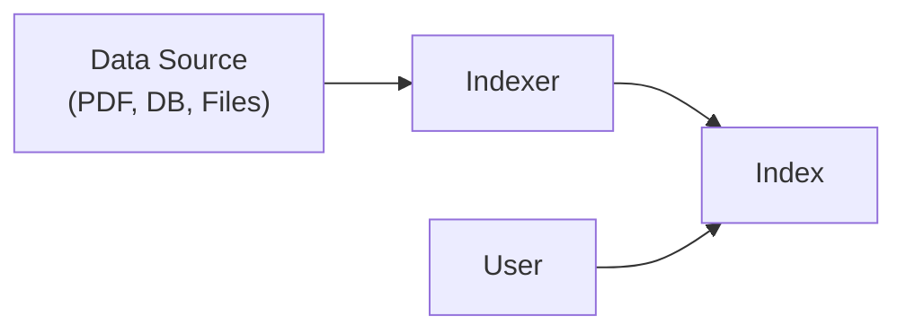
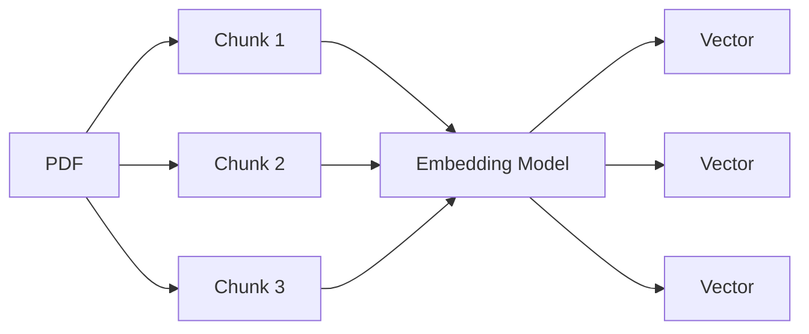
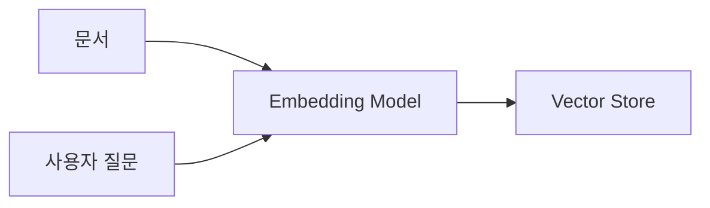
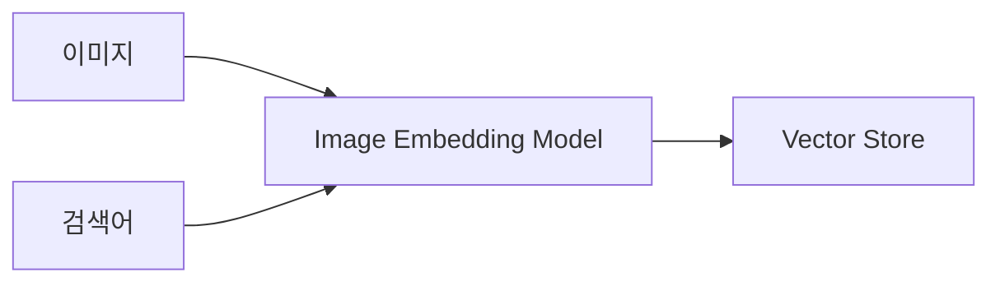
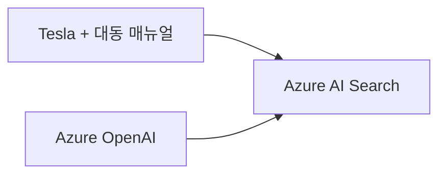
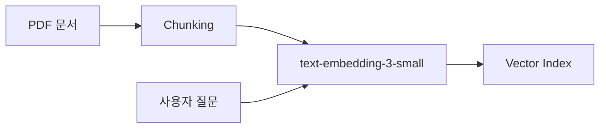

# Agentic AI 과정 - 5교시 정리
## Azure AI Search + Vector Search + Embedding

### 1. Azure Storage 복습

Azure Storage Account 내부에는 여러 종류의 저장소가 존재한다.

#### Blob Storage
- 객체(Object) 저장소
- PDF, 이미지, 영상 등의 파일 저장
- Container 단위로 관리
- Container 하나를 디스크처럼 생각해도 무방

#### File Share
- SMB 3.0 지원
- NAS(Network Attached Storage)와 유사
- 네트워크 드라이브처럼 사용 가능

#### Azure Data Box

대용량 데이터(수십~수백 TB)를 물리 장비로 Azure에 이전하는 방식이다.


---

### 2. PDF 업로드

실습용 Container

```text
pdf-data
```

업로드 문서

- Tesla Model Y User Manual
- 대동 트랙터 매뉴얼 3종

이후 Azure AI Search에서 Storage Account를 Data Source로 연결하였다.

---

### 3. Azure AI Search 데이터 처리 흐름

```text
원본 데이터(Data Source)
        ↓
     Indexer
        ↓
      Index
        ↓
     검색(Query)
```

Data Source:
- Blob Storage
- Database
- 기타 정형/비정형 데이터

Indexer:
- 원본 데이터 확인
- 문서 변경사항 감지
- Index 자동 갱신

Index:
- 검색을 위한 저장 구조



---

### 4. 정형 데이터와 비정형 데이터

정형 데이터

- SQL Database
- 테이블
- CSV

예)

```text
사번 | 이름 | 부서
```

비정형 데이터

- PDF
- Word
- Excel
- 이미지
- 동영상

Azure AI Search는 정형/비정형 데이터를 모두 인덱싱할 수 있다.

---

### 5. Vector Search 개념

기존 검색

```text
키워드
→ 검색
```

Vector Search

```text
문서
→ Embedding
→ Vector
→ 검색
```


---

### 6. Chunk 와 Chunking

#### Chunk

문서를 잘라서 만든 조각

예)

```text
Chunk #1
Chunk #2
Chunk #3
```

#### Chunking

문서를 여러 Chunk로 분할하는 과정



---

### 7. Chunk 크기

강사 경험상

```text
1024 토큰
```

정도가 적절

장점

- 충분한 문맥 유지
- 답변 품질 향상

단점

- 비용 증가
- 검색 결과 크기 증가

---

### 8. Embedding Model

사용 모델

```text
text-embedding-3-small
```

특징

- 1536차원 벡터 생성
- Vector Search용 모델
- 비용 효율적
- 일반적인 RAG 구축에 적합

---

### 9. Embedding의 역할

문서

```text
"타이어 공기압 확인 방법"
```

↓

```text
[0.123, -0.552, ...]
```

(1536차원 Vector)

---

사용자 질문

```text
"타이어 압력 확인"
```

↓

동일한 방식으로 Vector 생성

↓

유사도 계산

↓

관련 문서 검색

#### 문서 등록 과정


#### 검색(Query) 과정


---

### 10. Embedding Model은 운영 중에도 필요

많은 사람들이 오해하는 부분

Embedding Model은

- 문서 등록 시
- 사용자 검색 시

모두 사용된다.

```text
문서
→ Embedding
→ Vector 저장

질문
→ Embedding
→ Query Vector 생성
```



- 문서 등록 시 사용
- 사용자 검색 시 사용
- 운영 중에도 계속 필요

---

### 11. Vector DB (Vector Store)

Vector를 저장하는 저장소

구조

```text
PDF
→ Chunk
→ Embedding
→ Vector
→ Vector Store
```

Azure AI Search는

- Keyword Index
- Vector Store

기능을 함께 제공한다.


---

### 12. 이미지 벡터화(Image Vectorization)

선택 가능 옵션

역할

```text
이미지
→ Embedding
→ Vector
```

Google Photos와 유사

예)

- 비행기
- 개
- 밤
- 판교

등으로 검색 가능



---

### 13. AI 기반 데이터 보강

선택 가능 옵션

역할

```text
이미지 OCR
```

예)

- 스캔 PDF
- 표 이미지
- 캡처 이미지

↓

텍스트 추출

↓

검색 가능

이번 실습에서는 사용하지 않음.

이유

- 비용 때문은 아님
- PDF 자체에 텍스트가 포함되어 있음

---

### 14. Google Photos 사례

Google Photos는 사진을 업로드하면

```text
사진
→ AI 분석
→ Vector 저장
```

을 수행한다.

흥미로운 사례

```text
"뉴욕"
```

검색 시

```text
오다이바 야경
```

이 검색될 수 있음

이유

- 도시 야경
- 스카이라인
- 수변 풍경

등의 특징이 유사하기 때문

Vector Search는 정확한 일치보다 의미적 유사성을 검색한다.

---

### 15. Azure OpenAI 연결

Azure OpenAI 리소스

```text
labuser9-openai-interual
```

Microsoft AI Foundry 진입

↓

Model Catalog

↓

```text
text-embedding-3-small
```

배포

↓

Azure AI Search와 연결



---

### 16. 텍스트 벡터화 설정

Azure OpenAI Service

```text
labuser9-openai-interual
```

Embedding Model

```text
text-embedding-3-small
```

인증 방식

```text
API Key
```

선택

실습 환경에서 가장 간단한 방식

---

### 17. Parsing Mode

PDF 처리 방식

설정

```text
기본값(Default)
```

Tesla 및 대동 매뉴얼은 일반 PDF이므로 기본값 사용

---

### 18. Indexer Schedule

설정

```text
한 번(Once)
```

선택

이유

- 실습용 데이터
- 최초 인덱싱만 필요

실무에서는

- 매시간
- 매일
- 이벤트 기반

으로 설정 가능

---

### 19. 개체 이름 접두사

강사

```text
tesla
```

사용자

```text
manual
```

선택

이유

- Tesla뿐 아니라 대동 매뉴얼도 포함

생성 예

```text
manual-index
manual-indexer
manual-datasource
```

---

### 20. 인덱스 생성 중 발생한 현상

`manual` 인덱스 생성 시

실패 메시지 표시

↓

`pdfmanual` 로 다시 생성

↓

확인 결과

```text
manual
pdfmanual
```

둘 다 생성 완료

가능한 원인

- Azure Portal 상태 표시 지연
- 비동기 작업 완료 전 UI 오류
- 실제 생성은 성공했으나 화면상 실패 표시

교훈

실패 메시지가 나와도

- Index
- Indexer
- Data Source

생성 여부를 먼저 확인하는 것이 좋다.

---

## 오늘의 핵심

### 최종 Vector Search 구조


### Azure AI Search 전체 RAG 파이프라인



- PDF와 질문 모두 동일한 Embedding 모델을 사용한다.
- Vector Search를 수행하는 RAG의 핵심 구조다.

```text
PDF
↓
Chunking
↓
Embedding (text-embedding-3-small)
↓
1536차원 Vector
↓
Azure AI Search Index
↓
Vector Search
↓
RAG
```

오늘은 Azure AI Search와 Embedding Model을 이용하여
실제 RAG 시스템이 동작하는 핵심 원리를 학습하였다.
