# 4~5교시 Mermaid 다이어그램 모음

## 1. Azure AI Search 전체 구조

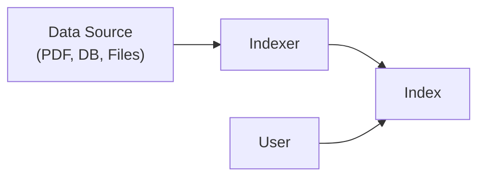

---

## 2. Azure AI Search + RAG 구조

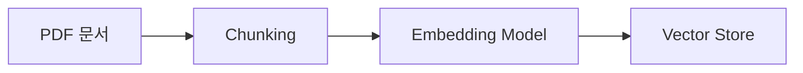

---

## 3. PDF → Chunk → Vector 생성 과정

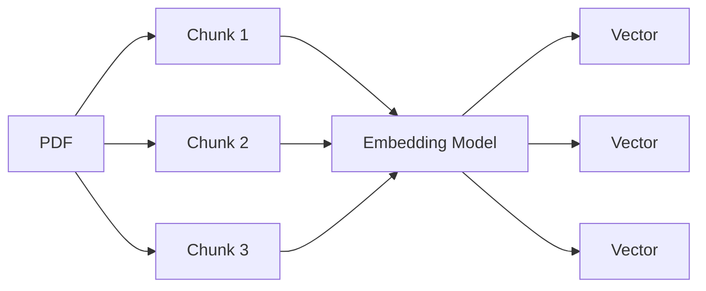

---

## 4. 문서 등록 과정

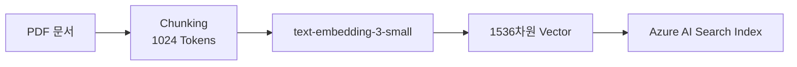

---

## 5. 검색(Query) 과정

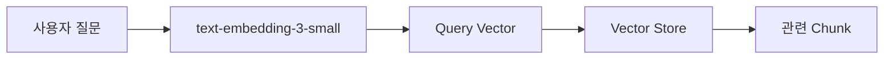

---

## 6. Embedding Model은 운영 중에도 사용

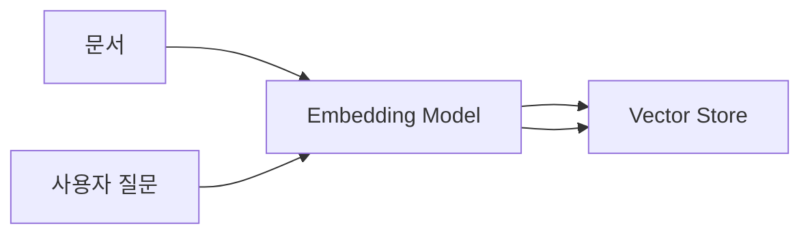

설명:

- 문서 등록 시 사용
- 사용자 검색 시 사용
- 운영 중에도 계속 필요

---

## 7. Vector DB (Vector Store)

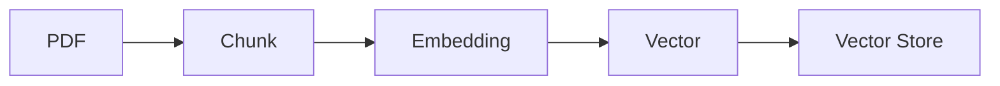

---

## 8. Azure AI Search + Azure OpenAI 연동

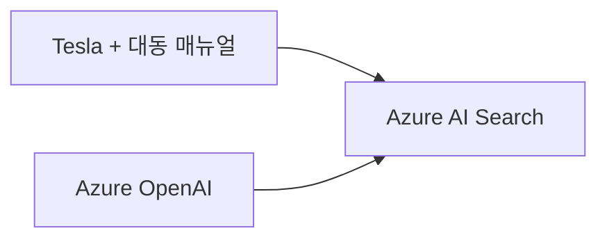

---

## 9. 최종 Vector Search 구조

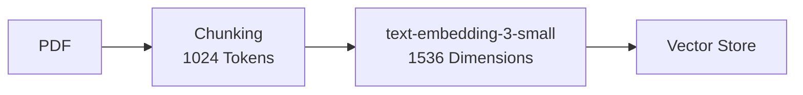

---

## 10. 이미지 벡터화(Image Vectorization)

Google Photos 예시

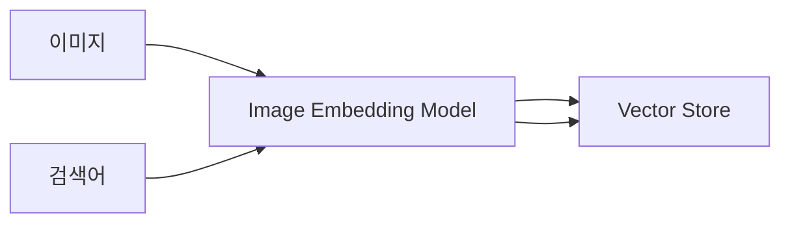

예)

- 비행기
- 개
- 밤
- 판교
- 뉴욕

---

## 11. Azure Data Box

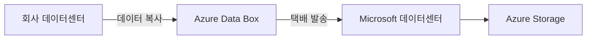

대용량 데이터(수십~수백 TB)를 물리 장비로 이전하는 방식

---

## 12. Azure AI Search 전체 RAG 파이프라인

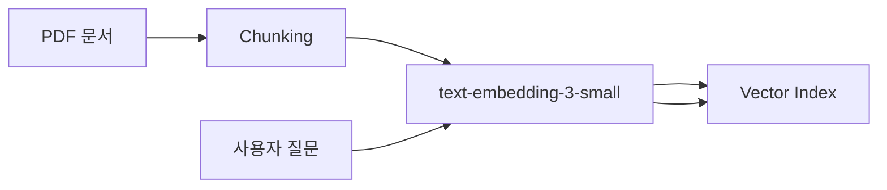

설명:

- PDF와 질문 모두 동일한 Embedding 모델 사용
- Vector Search 수행
- RAG의 핵심 구조
```
:::

특히 **12번 다이어그램**이 오늘 5교시의 핵심입니다. 강의 전체를 한 장으로 요약하면 사실상 저 그림 하나로 표현할 수 있습니다. PDF → Chunking → Embedding → Vector Index, 그리고 사용자 질문도 같은 Embedding을 거쳐 Vector Search를 수행한다는 구조입니다.