# Agentic AI 과정 - 6교시 정리
## Azure AI Search 심화 및 Azure AI Service

시간: 16:00 ~

---

# 1. Azure AI Search 내부 구조 확인

Azure Portal에서 생성한 Azure AI Search 리소스를 열어 내부 구성요소를 확인하였다.

확인 항목

- Data Source
- Index
- Indexer
- Skillset

---

## Azure AI Search 구조

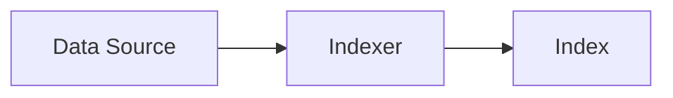

---

# 2. 생성된 Index 확인

Index 목록에서

```text
manual
```

인덱스를 선택하여 Search Explorer를 확인하였다.

---

## Search Explorer

검색 결과 예시

```json
{
  "@search.score": 0.57,
  "chunk_id": "...",
  "parent_id": "...",
  "chunk": "...",
  "title": "...",
  "text_vector": [...]
}
```

---

## 주요 필드

### chunk

실제 검색 대상 텍스트

예)

- 로터리 기능
- 쟁기 기능
- 작업등 설정
- 카메라 설정

---

### text_vector

Embedding 모델이 생성한 벡터

```text
1536 dimensions
```

---

## 문서 저장 구조

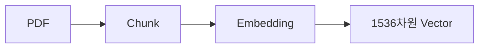

---

# 3. 차원의 저주 (Curse of Dimensionality)

Embedding 차원이 높다고 항상 좋은 것은 아니다.

예)

- 768 차원
- 1536 차원
- 3072 차원

---

데이터 수가 적은 경우

```text
벡터 공간이 너무 넓어짐
```

↓

```text
거리 계산이 어려워짐
```

↓

```text
검색 정확도 저하
```

---

## 개념도

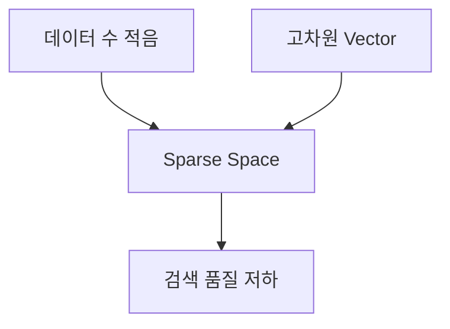

---

# 4. Keyword Search vs Vector Search

강사 의견

```text
어느 것이 더 좋은가?
→ 케이스 바이 케이스
```

---

## Keyword Search

유리한 경우

- 모델명
- 부품번호
- 도면번호
- 규격값

예)

```text
HX1300L-2C
SM-BTN-003
0.8 N·m
```

---

## Vector Search

유리한 경우

- 동의어
- 자연어
- 의미 기반 검색

예)

```text
체결 ↔ 조임
고정 ↔ 장착
```

---

## 비교

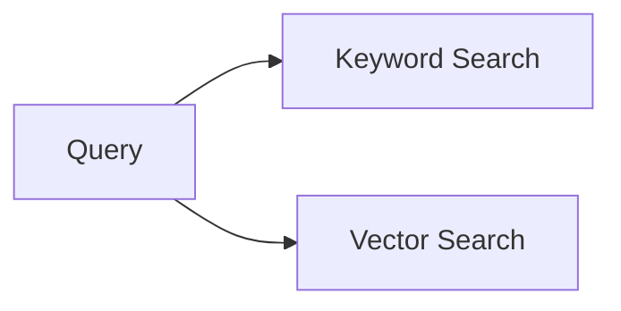

---

# 5. Vector Search의 한계

초기 AI 업계

```text
Vector Search가 모든 것을 해결한다
```

---

실제 서비스 운영

↓

Edge Case 발견

---

예시

### 모델명 검색

```text
HX1300L-2C
```

검색

Vector Search 결과

```text
HX1300L
HX1400L
TG310
```

등이 섞일 수 있음

---

### 부품번호 검색

```text
SM-BTN-003
```

검색

Vector Search 결과

```text
SM-BTN-002
SM-BTN-004
```

도 유사하다고 판단 가능

---

# 6. Hybrid Search

현재 업계의 주류 방식

```text
Keyword Search
+
Vector Search
```

---

## 구조

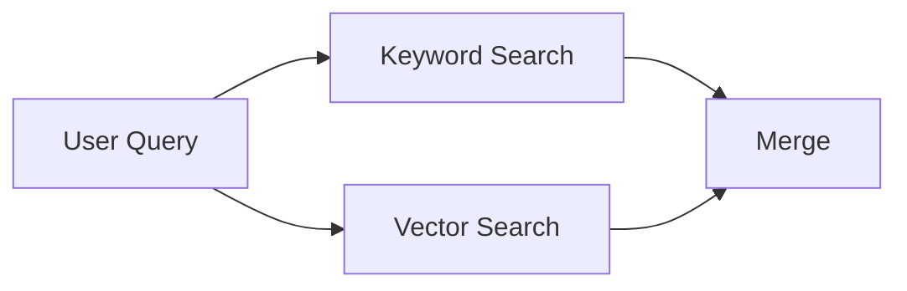

---

장점

### Keyword

- 정확한 일치

### Vector

- 의미 검색

---

둘을 동시에 활용

---

# 7. Merge만으로는 부족

문제

```text
결과 수만 증가
```

---

예)

Keyword Top 10

+

Vector Top 10

↓

20개 결과

↓

관련 없는 문서 증가

---

# 8. Reranker

해결 방법

```text
Query
+
Merge 결과
```

를 다시 AI가 평가

---

## 구조

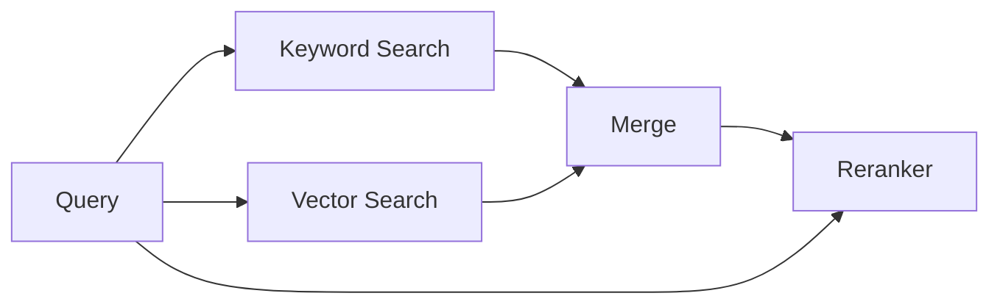

---

역할

```text
후보 문서를 다시 평가
```

↓

```text
순위 재조정
```

↓

```text
최적 결과 선택
```

---

# 9. Reranking 비용

Reranker도 비용이 발생한다.

이유

```text
Query
+
후보 Chunk
```

를 다시 모델이 읽어야 하기 때문

---

실무

```text
Keyword Search
+
Vector Search
+
Reranker
```

구조를 사용

---

# 10. Vector DB의 변화

초기

```text
PostgreSQL
+
Vector DB
```

---

최근

```text
PostgreSQL
Oracle
SQL Server
```

자체적으로 Vector 지원

---

## 진화

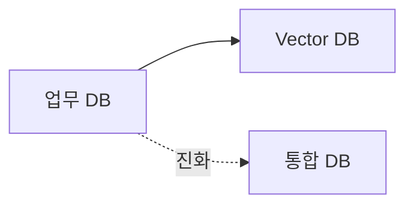

---

예)

### PostgreSQL

```text
pgvector
```

---

### Oracle

```text
VECTOR 타입
```

지원

---

# 11. Azure AI Search의 미래 방향

현재 검색 구조

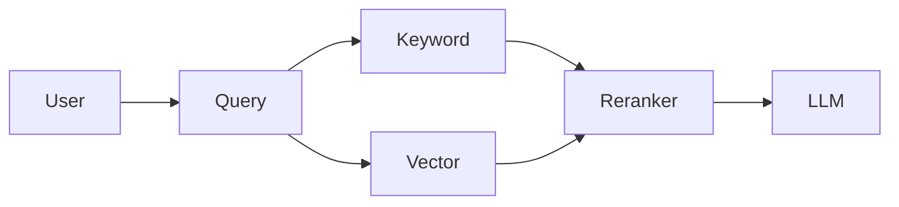

---

# 12. Azure AI Service 생성

생성한 리소스

```text
Microsoft.CognitiveServicesAllInOne-20260618164013
```

---

생성 Region

```text
Central US
```

---

이유

기존 AI Search와 동일 Region

---

장점

- 트래픽 비용 절감
- 지연시간 감소
- 연동 용이

---

## Region 설계

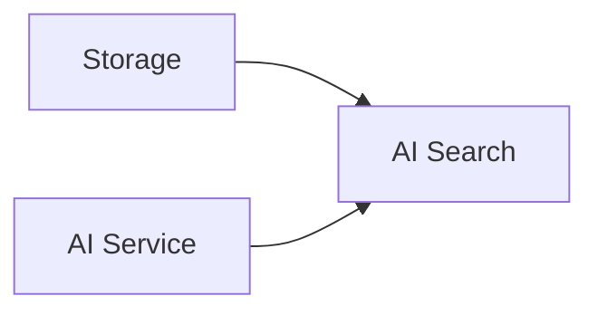

---

# 13. Cognitive Services의 역사

예전 명칭

```text
Cognitive Services
```

---

현재 명칭

```text
Azure AI Services
```

---

그러나 내부 리소스 이름은 여전히

```text
Microsoft.CognitiveServices
```

를 사용

---

## 역사

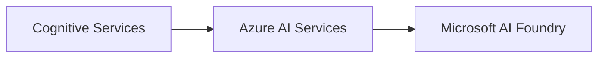

---

# 14. Microsoft AI Foundry

흥미로운 점

```text
Azure AI Foundry
```

가 아니라

```text
Microsoft AI Foundry
```

라는 명칭 사용

---

의미

AI 플랫폼을

Azure 제품이 아니라

Microsoft 전체 플랫폼으로 확장하려는 전략

---

## 브랜딩 변화

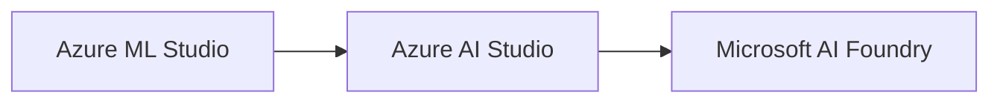

---

# 15. Azure AI Service 내부 기능

생성한 서비스 내부에서 확인

- 결정(Decision)
- 언어(Language)
- 음성(Speech)
- 비전(Vision)
- 문서 인텔리전스(Document Intelligence)
- Metrics Advisor
- 컨테이너(Container)

---

## 구성도

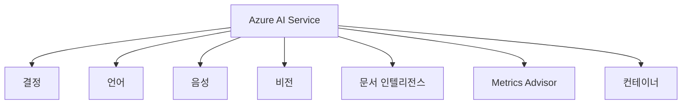

---

# 16. 강사 평가

## Speech

```text
아직 아쉬움
```

이유

- 잡음
- 전문용어
- 현장 환경

등에서 한계 존재

---

## Vision

```text
상당히 실용적
```

활용 예

- OCR
- 이미지 분석
- 객체 탐지
- 문서 분석

---

인터루얼 관점

```text
작업 사진
불량 사진
스캔 문서
```

등에 활용 가능

---

# 오늘의 핵심

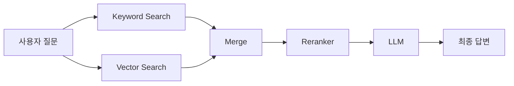

초기에는 Vector Search가 미래로 여겨졌지만,

현재 업계는

**Keyword Search + Vector Search + Reranker**

를 결합한 Hybrid Search 구조를 주류로 사용하고 있다.

또한 Oracle, PostgreSQL, SQL Server 등 기존 DB도 Vector 기능을 내장하기 시작했으며, Azure는 Microsoft AI Foundry를 중심으로 AI 플랫폼을 통합하는 방향으로 발전하고 있다.