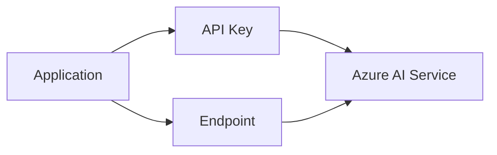
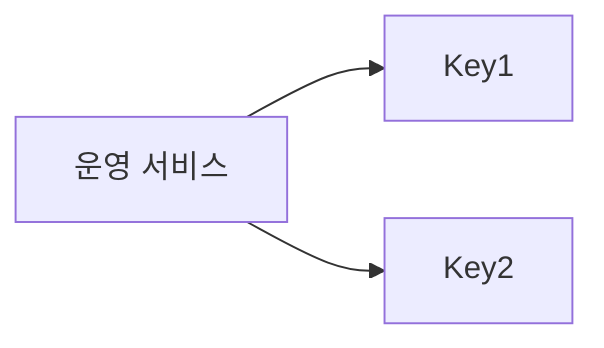
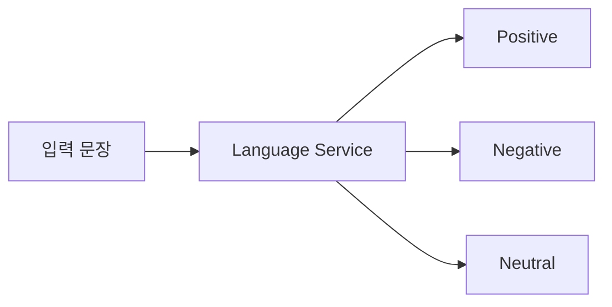
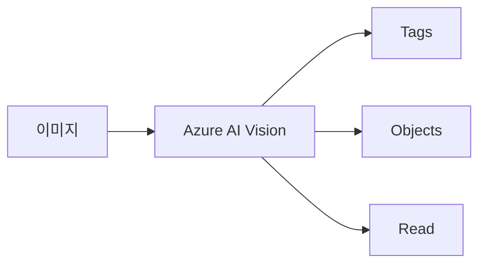
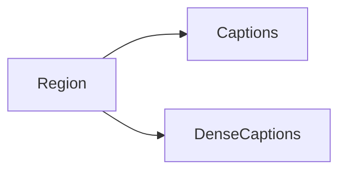
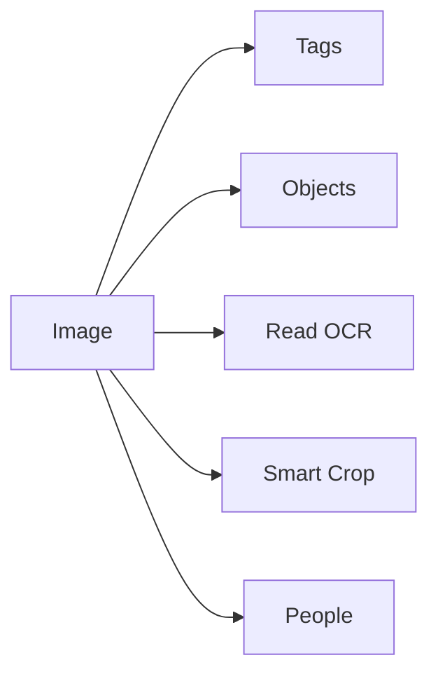
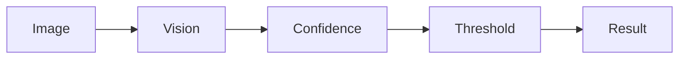
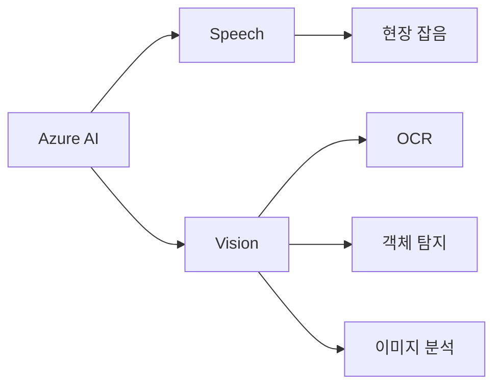
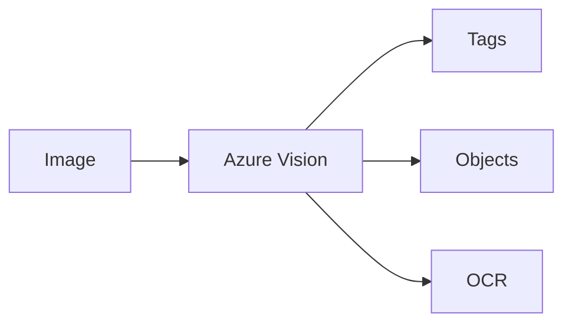

# Agentic AI 과정 - 7교시 정리
## Azure AI Service 활용 및 Vision API 실습

시간: 17:00 ~

---

# 1. Azure AI Service 활용 시작

이전 교시에 생성한 Azure AI Service를 실제로 사용하는 방법을 학습하였다.

생성된 리소스

```text
Microsoft.CognitiveServicesAllInOne-20260618164013
```

---

## Azure AI 호출 구조



---

# 2. 키 및 엔드포인트 확인

메뉴

```text
Azure AI Service
→ 리소스 관리
→ 키 및 엔드포인트
```

확인

- Key1
- Key2
- Endpoint URL

---

## 역할

### Endpoint

예)

```text
https://xxxxx.cognitiveservices.azure.com/
```

AI 서버 주소

---

### API Key

사용자 인증 정보

---

## Key Rotation

Azure는 Key1, Key2를 제공한다.



운영 중에도 인증키 교체 가능

---

# 3. Azure AI Language

Azure AI Service는 Language 기능을 제공한다.

---

## Sentiment Analysis

문장의 감정을 분석

### Positive

```text
이 제품은 정말 좋다.
```

↓

```text
Positive
```

---

### Negative

```text
품질이 너무 나쁘다.
```

↓

```text
Negative
```

---

### Neutral

```text
오늘 배송되었다.
```

↓

```text
Neutral
```

---

## 구조



---

## 활용 분야

- 리뷰 분석
- VOC 분석
- SNS 분석
- 상담 내용 분석

---

# 4. Azure AI Vision 실습

강사 평가

```text
Speech는 아직 아쉬움
Vision은 상당히 쓸만함
```

---

이번 실습에서는 Vision API를 사용하여

이미지 분석을 수행하였다.

---

## Vision 분석 구조



---

# 5. Region 제한 사례

Vision API 실행 시 다음 오류 발생

```text
The feature 'Captions' is not supported in this region.
The feature 'DenseCaptions' is not supported in this region.
```

---

## 원인

현재 생성한 AI Service Region

```text
Central US
```

에서는

- Captions
- DenseCaptions

기능을 지원하지 않음

---

## 교훈

Azure AI 기능은

Region마다 지원 여부가 다를 수 있다.

---

## 구조



---

# 6. Vision API 분석 결과

실습 이미지

```text
dog_cat_1.jpg
dog_cat_2.jpg
dog_cat_3.jpg
dog_cat_4.jpg
```

---

## 사용 기능

### Tags

이미지 전체 특징 추출

예)

```text
dog
cat
animal
mammal
grass
pet
indoor
outdoor
```

---

### Objects

객체 탐지

예)

```text
dog
cat
```

+

Bounding Box

---

### Read

OCR

이번 이미지에는 텍스트가 없어

```text
blocks = []
```

---

### Smart Crops

자동 크롭 추천

예)

```text
0.9 비율
1.33 비율
```

---

### People

사람 탐지

이번 이미지에서는

confidence가 매우 낮음

실질적으로 사람 없음

---

## Vision 결과 구조



---

# 7. 분석 결과 관찰

흥미로운 점

태그 결과와 객체 탐지 결과가 항상 일치하지 않았다.

---

예시

### dog_cat_1

Tags

```text
cat
domestic cat
felidae
```

높은 점수

---

Objects

```text
dog
```

탐지

---

### dog_cat_4

Tags

```text
dog
cat
```

동시 존재

---

Objects

```text
cat
```

탐지

---

## 의미

Vision 결과는

```text
확률 기반 추론
```

이다.

---

## 실제 운영



---

Confidence 기준을 설정하여

후처리를 수행하는 것이 일반적이다.

---

# 8. Speech vs Vision

강사 의견

---

## Speech

현재

```text
아직 아쉬움
```

이유

- 잡음
- 전문용어
- 현장 환경

---

## Vision

현재

```text
실용적
```

활용

- OCR
- 객체 인식
- 이미지 분석
- 문서 분석

---

## 비교



---

# 인터루얼 관점

Vision 계열 활용 가능성

- 작업 사진 분석
- 불량 사례 분석
- 조립 상태 확인
- 스캔 PDF OCR
- 작업자 촬영 이미지 분석

---

# 오늘의 핵심



Azure AI Service는

- Language
- Vision
- Speech

등 다양한 AI 기능을 제공한다.

이번 실습에서는 Vision API를 사용하여

- 태그 추출
- 객체 탐지
- OCR
- Smart Crop

기능을 확인하였으며,

Region에 따라 지원 기능이 달라질 수 있다는 점도 확인하였다.

또한 실제 Vision 결과는 확률 기반이므로 신뢰도(Confidence)를 고려한 후처리가 중요하다는 점을 학습하였다.