# AI Agent 기반 SaaS 플랫폼 설계 문서

## 1. 프로젝트 개요

프로젝트명: AI Agent Workflow Studio

목표:
- 자연어 기반 Workflow 생성
- Agent 자동 연결
- Tool Calling 지원
- SaaS 형태 서비스 제공

주요 기술:
- GPT-5
- Microsoft Agent Framework
- n8n
- PostgreSQL
- Node.js
- Azure OpenAI

---

# 2. 프로젝트 구조 (Mindmap)

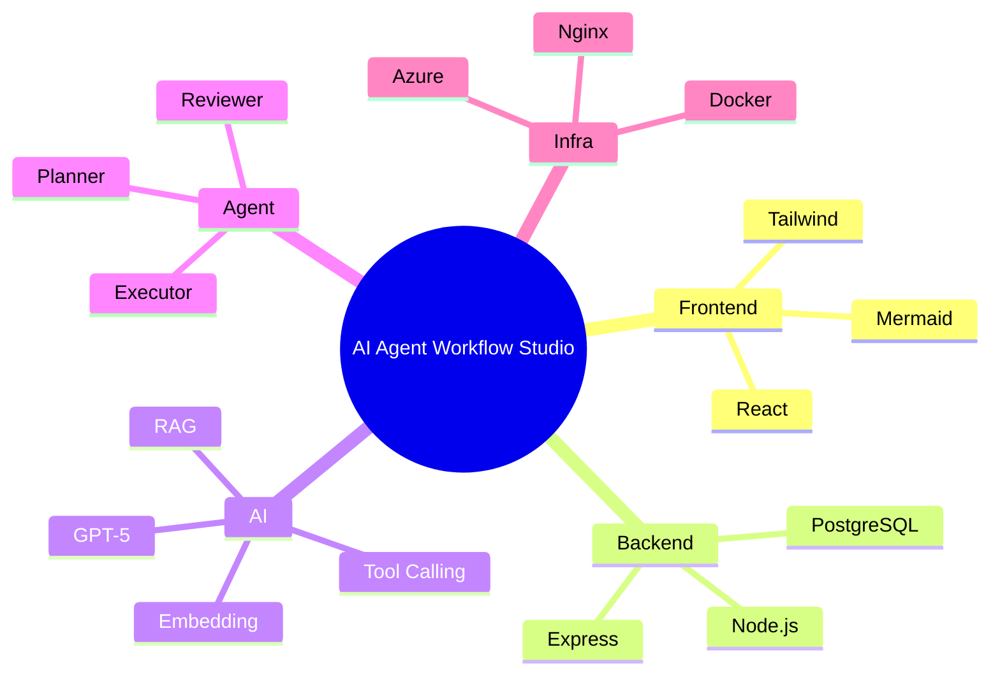

---

# 3. 사용자 Workflow

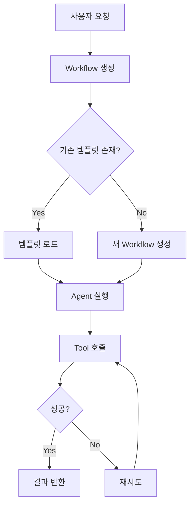

---

# 4. Agent 호출 Sequence

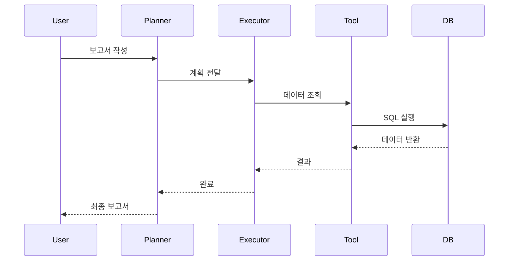

---

# 5. 상태 전이도

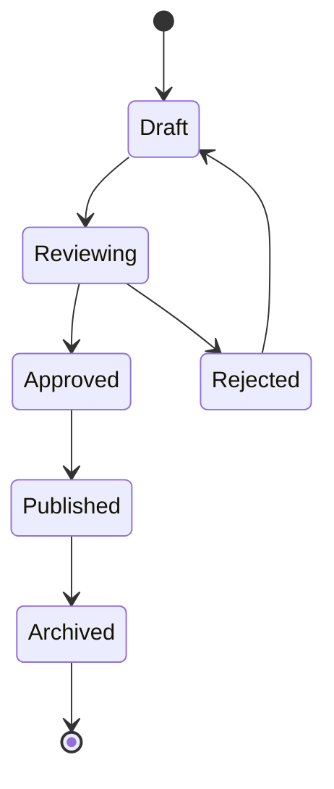

---

# 6. 클래스 구조

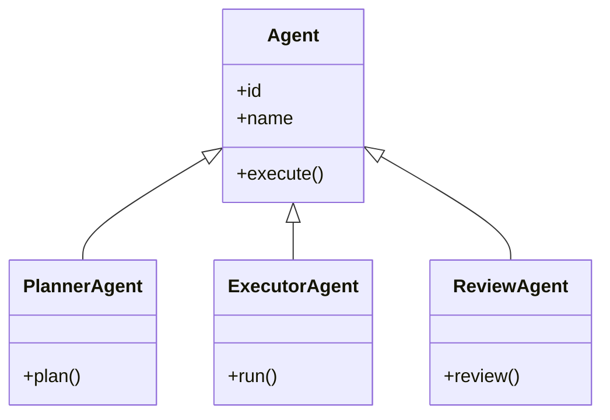

---

# 7. 데이터베이스 설계

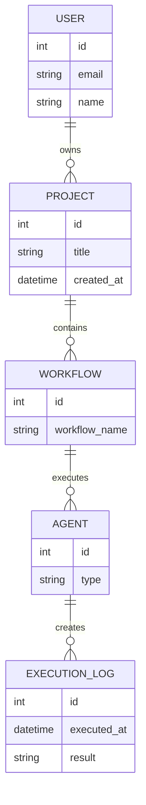

---

# 8. 고객 여정

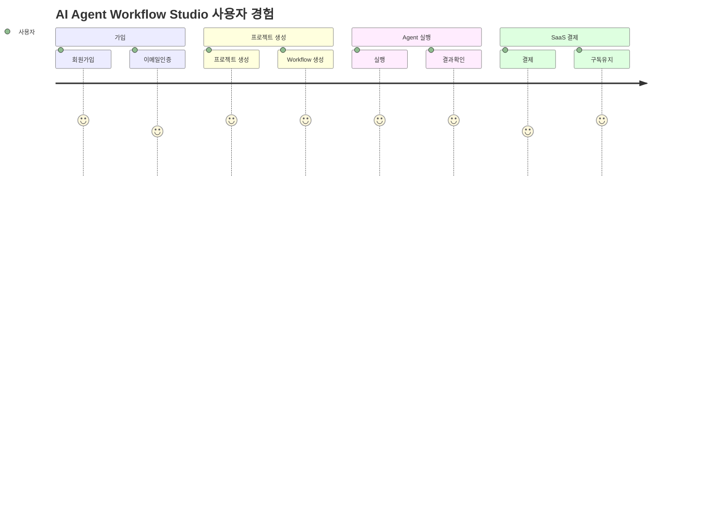

---

# 9. 개발 일정

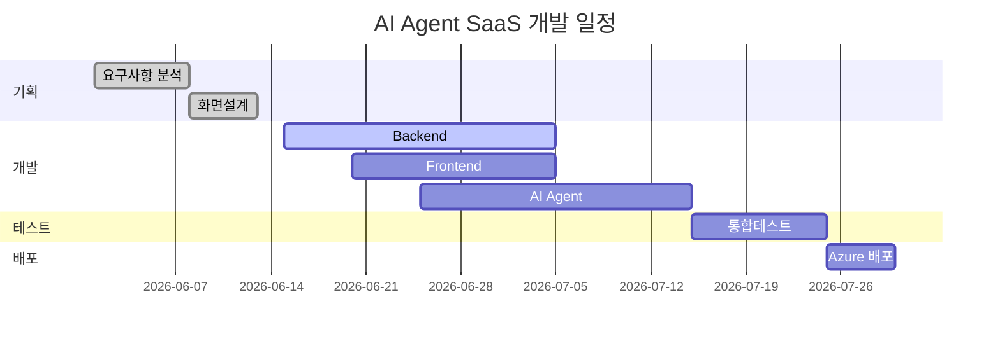

---

# 10. SaaS 매출 구성

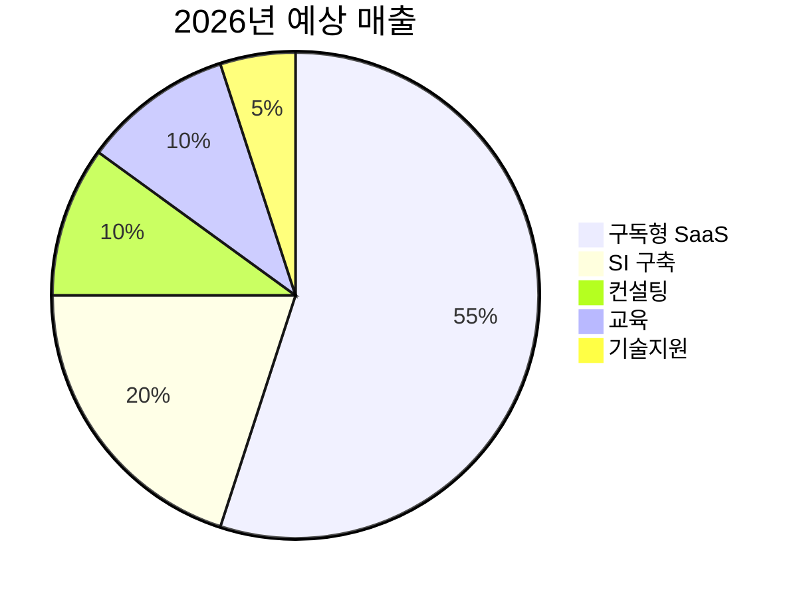

---

# 11. Git Flow

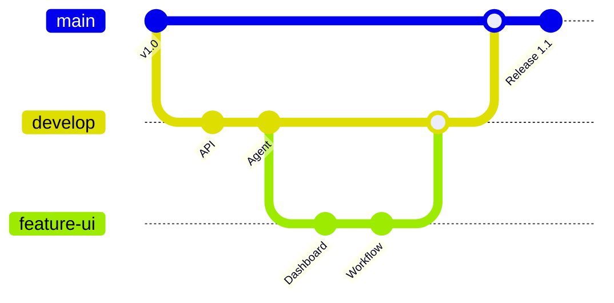

---

# 12. 요구사항

```mermaid
requirementDiagram

requirement login {
    id: R1
    text: OAuth 로그인 지원
    risk: low
    verifymethod: test
}

requirement workflow {
    id: R2
    text: Workflow 생성
    risk: medium
    verifymethod: demo
}

requirement agent {
    id: R3
    text: Agent 실행
    risk: high
    verifymethod: test
}

login - contains -> workflow
workflow - contains -> agent
```

---

# 13. 서비스 발전 Timeline

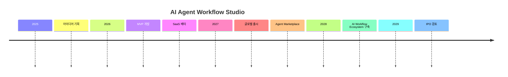

---

# 14. 경쟁사 비교

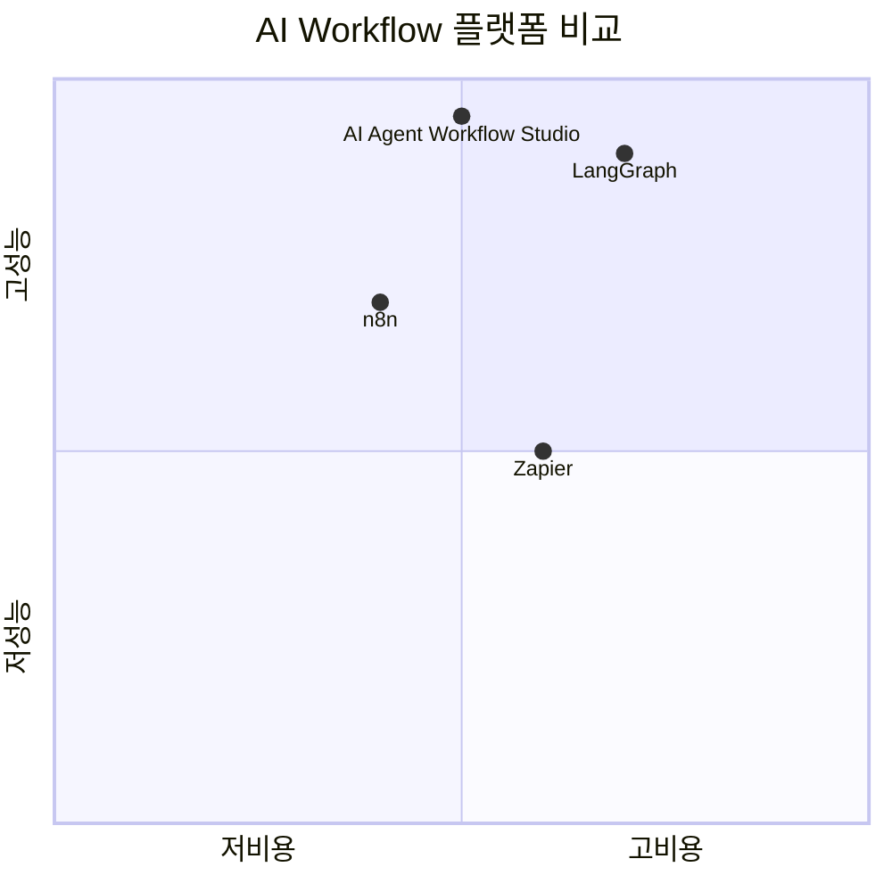

---

# 15. 시스템 컨텍스트 (C4)

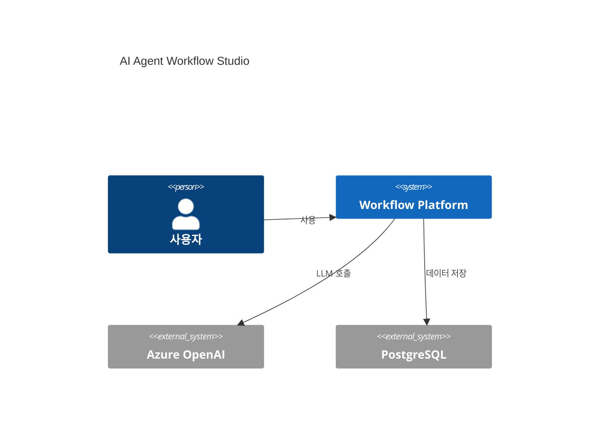

---

# 16. 배포 아키텍처

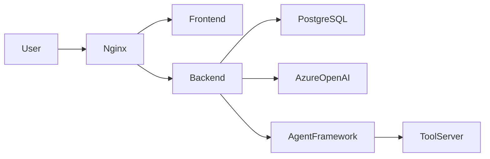

---

# 17. 결론

본 시스템은

- AI Agent
- Workflow 자동화
- SaaS 플랫폼
- Tool Calling
- RAG
- Multi-Agent

를 통합한 차세대 업무 자동화 플랫폼을 목표로 한다.